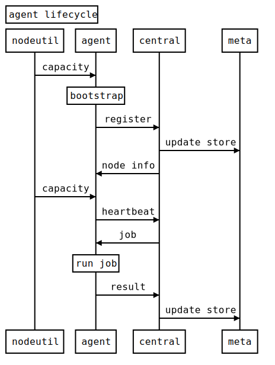
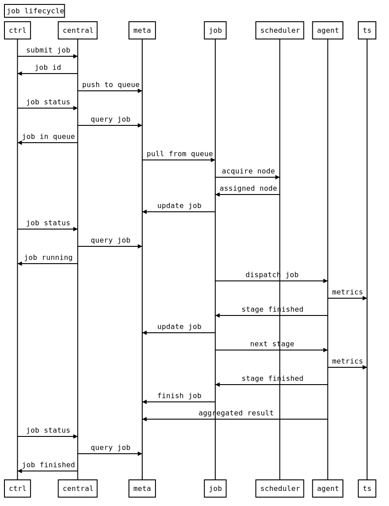

# Flow

Workflow (life cycle) of agent, central, job

## Agent

````text
title: agent lifecycle
nodeutil->agent: capacity
Note over agent: bootstrap
agent->central: register
central->meta: update store
central->agent: node info
nodeutil->agent: capacity
agent->central: heartbeat
central->agent: job
Note over agent: run job
agent->central: result
central->meta: update store
````



## Central

see agent and job

## Job

````text
title: job lifecycle
# sumbit job
ctrl->central: submit job
central->ctrl: job id
central->meta: push to queue
ctrl->central: job status
central->meta: query job
central->ctrl: job in queue
# schedule
meta->job: pull from queue
job->scheduler: acquire node
scheduler->job: assigned node
job->meta: update job
ctrl->central: job status
central->meta: query job
central->ctrl: job running
# execution
job->agent: dispatch job
agent->ts: metrics
agent->job: stage finished
job->meta: update job
job->agent: next stage
agent->ts: metrics
agent->job: stage finished
# report
job->meta: finish job
agent->meta: aggregated result
ctrl->central: job status
central->meta: query job
central->ctrl: job finished
````

Graph generated using [util/sequence-diagram.html](util/sequence-diagram.html) https://bramp.github.io/js-sequence-diagrams/

